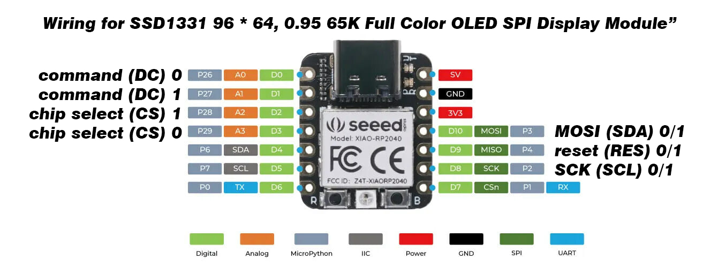

# expression
Facial expressions for simple robots.

This library is so straight-forward it really doesn't need a whole read-the-docs (yet).
Just look at example_main.py and expression/exammple.py for general use.

