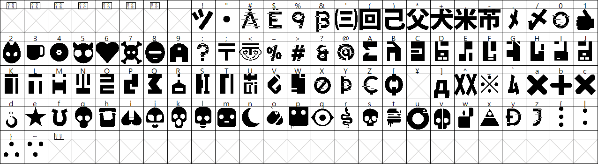

# expression

Facial expressions for simple robots.

This library is so straight-forward it really doesn't need a whole read-the-docs (yet).
Just look at example_main.py and expression/example.py for general use.

https://user-images.githubusercontent.com/24589462/189183387-5137dcc8-b593-4a2c-8939-d697de0b7deb.mp4

# Features (so-far)

* Independent eye control
* Background / foreground colors
* Saccades movements to add realism
* Blink-to-mask to assist with low refresh-rates
* Independent top/bottom "squint"
* Eye-shaping sprites in quadrants allowing for many, many variations
* Eye-position transitions with variable speed
* Eye-rotation transitions with variable speed and radius
* Full complement of sweet icons from Love, Death+Robots and other royalty free sources.
  * https://uxuihero.com/love-death-robots-free-fan-iconfont/
* Screensaver with slick transitions n jazz
* Memory consumption of roughly 65kb

# Typeset icons

These options are available when using the expression.Eyes.iris_to_icon method. 

https://user-images.githubusercontent.com/24589462/188916559-694f9836-d02d-4c66-961c-4be286e1a1f8.mp4

